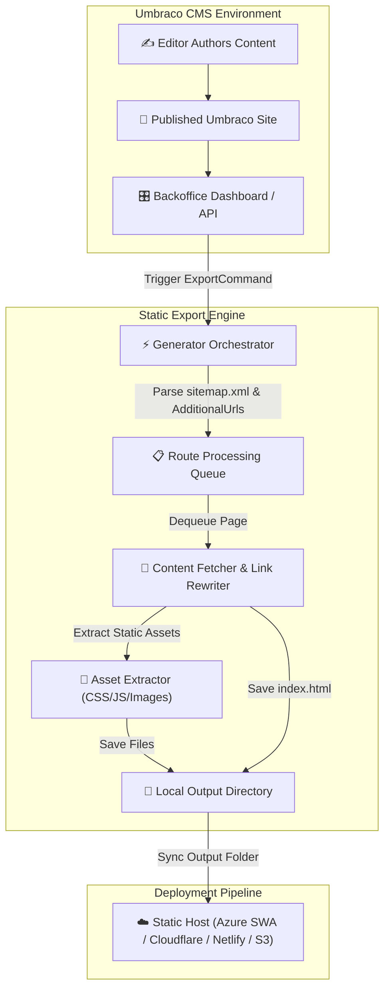
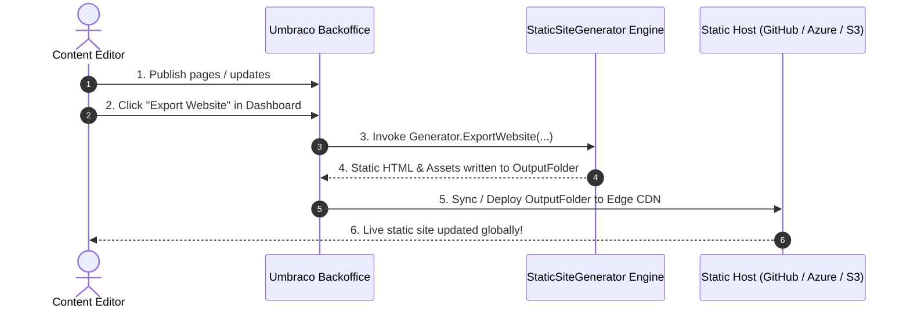

<div align="center">

# 🌐 Umbraco Static Site Generator & Exporter

**Transform dynamic Umbraco CMS websites into high-performance static HTML snapshots for edge deployment.**

[](https://www.nuget.org/packages/Sekmen.StaticSiteGenerator)
[](https://www.nuget.org/packages/Umbraco.Community.HtmlExporter)
[](https://dotnet.microsoft.com/)
[](https://umbraco.com/)
[](https://opensource.org/licenses/MIT)

<p align="center">
  <a href="#-why-use-this-tool">Why</a> •
  <a href="#-packages-ecosystem">Packages</a> •
  <a href="#-key-features">Key Features</a> •
  <a href="#-architecture--workflow">Architecture</a> •
  <a href="#-umbraco-plugin-setup-umbracocommunityhtmlexporter">Umbraco Plugin</a> •
  <a href="#-quick-start-c-core-library-sekmenstaticsitegenerator">Core API</a> •
  <a href="#%EF%B8%8F-development--contributing">Development</a>
</p>

---

</div>

## 📸 Dashboard Preview


---

## 💡 Why Use This Tool?

Dynamic Content Management Systems like **Umbraco** offer fantastic content authoring workflows, but hosting live CMS instances facing public traffic can introduce costs, maintenance overhead, and security concerns.

This repository provides an end-to-end static export solution that lets content editors continue using Umbraco while serving visitors a pre-rendered static snapshot hosted on global static CDNs:

- ⚡ **Blazing Fast Performance**: Zero server-side rendering or database latency. Pages load instantly via global Edge CDNs.
- 💰 **Massive Cost Savings**: Host sites on virtually free static providers (**Azure Static Web Apps**, **GitHub Pages**, **Netlify**, **Cloudflare Pages**, **AWS S3 + CloudFront**).
- 🛡️ **Unbreakable Security**: No exposed database endpoints, admin panels, or dynamic server runtime vulnerabilities facing public users.
- 🌍 **High Availability**: Immune to traffic spikes, database crashes, or server downtime.

---

## 📦 Packages Ecosystem

| Package | Purpose & Focus | Badges |
| :--- | :--- | :--- |
| [`Sekmen.StaticSiteGenerator`](file:///d:/Projects/Umbraco.StaticSiteGenerator/Sekmen.StaticSiteGenerator) | **Core Engine** (v1.5.0) — Lightweight C# library for crawling HTML/sitemaps, extracting resources, and rewriting URLs. | [](https://www.nuget.org/packages/Sekmen.StaticSiteGenerator) |
| [`Umbraco.Community.HtmlExporter`](file:///d:/Projects/Umbraco.StaticSiteGenerator/Umbraco.Community.HtmlExporter) | **Umbraco Plugin** — Backoffice dashboard UI & secured management API controller for Umbraco editors. | [](https://www.nuget.org/packages/Umbraco.Community.HtmlExporter) |
| [`Sekmen.StaticSiteGenerator.Tests`](file:///d:/Projects/Umbraco.StaticSiteGenerator/Sekmen.StaticSiteGenerator.Tests) | **Test Suite** — Comprehensive integration tests validating crawling, asset extraction, and path rewriting. |  |

---

## 🔥 Key Features

- 🗺️ **Sitemap & On-the-Fly Link Crawling**: Automatically seeds the processing queue with `sitemap.xml` entries and discovers new internal pages via HTML `<a href="...">` links.
- 🎨 **Deep Asset Collection**: Scans HTML nodes and CSS stylesheets for `<link>`, `<script>`, ``, and inline `background-image: url(...)` asset references.
- ⚡ **Smart Resource Reuse**: Prevents duplicate downloads by skipping existing static files on disk.
- 🔗 **Automatic Link Rewriting**: Replaces source domain references and relative URLs with configured `TargetUrl` origins.
- 🎯 **Manual Page Injection (`AdditionalUrls`)**: Force export unlinked pages, custom landing pages, `/404`, `/robots.txt`, or `/sitemap.xml`.
- 📁 **Folder-Style Page Routing**: Formats nested routes (e.g. `/about/us`) cleanly as directory `index.html` structures (`/about/us/index.html`).
- 🔀 **Two-Phase String Replacements**: Apply custom sequential find-and-replace transformations across computed file paths first, then full HTML content second.
- 🛡️ **Minimal Dependencies**: Core engine depends solely on `HtmlAgilityPack` for maximum stability and speed.

---

## 🔄 Architecture & Workflow



---

## 🔌 Umbraco Plugin Setup (`Umbraco.Community.HtmlExporter`)

Equip your Umbraco Backoffice with an interactive dashboard UI allowing editors to configure parameters and trigger static site exports on demand.

### 1. Install Package
```bash
dotnet add package Umbraco.Community.HtmlExporter
```

### 2. Register Service in `Program.cs`
```csharp
builder.Services.AddHtmlExporter(builder.Configuration);
```

### 3. Configure `appsettings.json`
Add default export configurations under the `ExportHtmlSettings` section:

```json
{
  "ExportHtmlSettings": {
    "TargetUrl": "https://static.mywebsite.com/",
    "OutputFolder": "C:\\Exports\\MyWebsite",
    "AdditionalUrls": [
      "/sitemap.xml",
      "/404",
      "/robots.txt",
      "/humans.txt",
      "/manifest.json"
    ],
    "StringReplacements": [
      {
        "OldValue": "umbraco-cms",
        "NewValue": "umbraco"
      },
      {
        "OldValue": "Umbraco CMS",
        "NewValue": "Umbraco"
      }
    ]
  }
}
```

### 4. Secured Backoffice API Endpoints

- **`GET /umbraco/umbracocommunityhtmlexporter/api/v1/get-data`**  
  Returns configured settings and list of root domains assigned in Umbraco.
- **`POST /umbraco/umbracocommunityhtmlexporter/api/v1/export-website`**  
  Accepts a `multipart/form-data` payload matching `ExportCommand` to run the website export in the background.

```bash
curl -X POST \
  -H "Cookie: UMB_UCONTEXT=your_umbraco_backoffice_auth_cookie" \
  -F "SiteUrl=mywebsite.local" \
  -F "AdditionalUrls=/sitemap.xml" \
  -F "AdditionalUrls=/404" \
  -F "TargetUrl=https://static.mywebsite.com/" \
  -F "OutputFolder=C:\Exports\MyWebsite" \
  -F "StringReplacements[0].OldValue=umbraco-cms" \
  -F "StringReplacements[0].NewValue=umbraco" \
  https://mywebsite.local/umbraco/umbracocommunityhtmlexporter/api/v1/export-website
```

---

## ⚡ Quick Start: C# Core Library (`Sekmen.StaticSiteGenerator`)

You can also use the core engine programmatically in console apps, background workers, or CI/CD build scripts without Umbraco:

```csharp
using Sekmen.StaticSiteGenerator;

// 1. Prepare HTTP Client
using var client = new HttpClient();

// 2. Define Export Parameters
var command = new ExportCommand(
    SiteUrl: "example.com",
    AdditionalUrls: new[] { "/404", "/custom-landing" },
    TargetUrl: "https://static.example.com/",
    OutputFolder: Path.Combine(Directory.GetCurrentDirectory(), "dist"),
    StringReplacements: new[]
    {
        new StringReplacements("umbraco-cms", "umbraco")
    }
);

// 3. Run Generator
await Generator.ExportWebsite(client, command);
Console.WriteLine("Export finished! Files saved to ./dist");
```

---

## 🚀 Recommended Deployment Workflow



---

## 💡 Troubleshooting & Diagnostics

| Symptom | Probable Cause | Action |
| :--- | :--- | :--- |
| **Output directory is empty** | Host name resolution failure or early exception during crawl. | Inspect application console logs or check `SiteUrl` accessibility. |
| **Certain routes are missing** | Route is unlinked in DOM and missing from `sitemap.xml`. | Add paths explicitly to `AdditionalUrls`. |
| **Broken relative assets or links** | `TargetUrl` lacks trailing slash. | Ensure `TargetUrl` ends with `/` (e.g., `https://static.site.com/`). |
| **Backoffice API returns 401/403** | Missing Umbraco backoffice authentication cookie or policy grant. | Authenticate in Umbraco Backoffice before calling POST endpoint. |

---

## ⚠️ Current Limitations

> [!WARNING]
> - **Sitemap Reliance**: Initial route discovery requires a valid `sitemap.xml` file at `https://{SiteUrl}/sitemap.xml`.
> - **Sequential Execution**: Crawls and asset downloads run sequentially.
> - **Client-Side SPAs**: Does not execute JavaScript for single-page applications rendered exclusively on the client.

---

## 🛠️ Development & Contributing

### Prerequisites
- **.NET SDK 10.0 / 9.0**
- **Node.js 20.17.0+** (for Backoffice Lit WebComponent compilation)

### Build Steps

1. **Clone Repository & Restore Dependencies**:
   ```bash
   git clone https://github.com/sekmenhuseyin/Sekmen.StaticSiteGenerator.git
   cd Sekmen.StaticSiteGenerator
   dotnet restore
   ```

2. **Build Full Solution**:
   ```bash
   dotnet build Sekmen.StaticSiteGenerator.slnx
   ```

3. **Build Client WebComponents (Plugin UI)**:
   ```bash
   cd Umbraco.Community.HtmlExporter/Client
   npm install
   npm run build
   cd ../..
   ```

4. **Run Integration & Unit Tests**:
   ```bash
   dotnet test Sekmen.StaticSiteGenerator.slnx
   ```

5. **Generate NuGet Packages**:
   ```bash
   dotnet pack -c Release
   ```

---

## 🔒 Security Guidelines

> [!CAUTION]
> Protect the `export-website` API endpoint with authorization policies. Unrestricted public access could allow unauthorized users to trigger heavy disk and bandwidth consumption.

---

## 📜 License & Credits

Distributed under the **MIT License**. Created and maintained by **Hüseyin Sekmenoğlu**.

<div align="center">

Made with ❤️ for the **.NET** & **Umbraco** Community.

</div>
