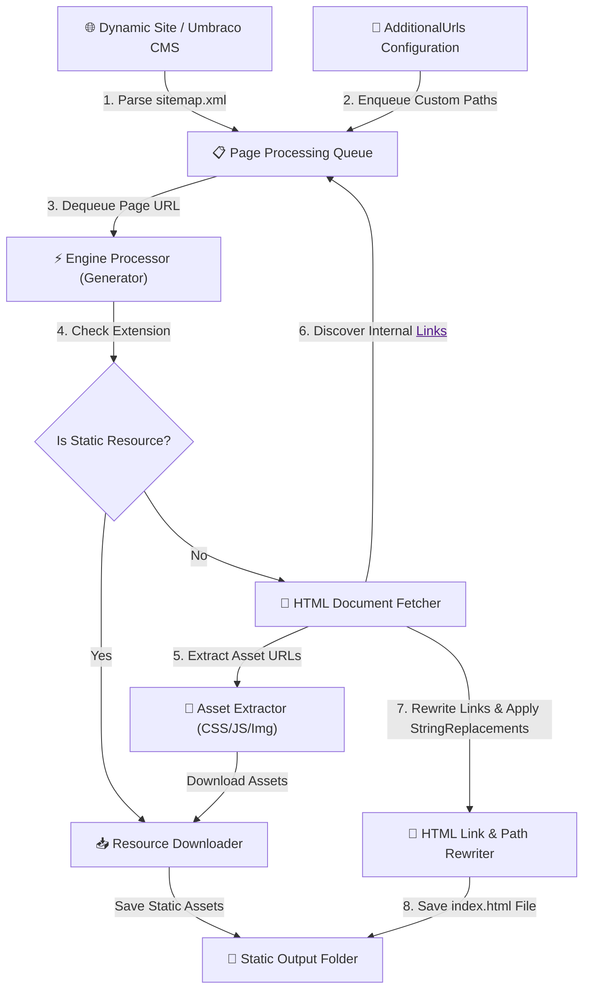

<div align="center">

# 🚀 Sekmen.StaticSiteGenerator

**High-performance, flexible static site export utility for .NET & Umbraco CMS.**

[](https://www.nuget.org/packages/Sekmen.StaticSiteGenerator)
[](https://www.nuget.org/packages/Sekmen.StaticSiteGenerator)
[](https://dotnet.microsoft.com/)
[](https://umbraco.com/)
[](https://opensource.org/licenses/MIT)
[](https://github.com/sekmenhuseyin/Sekmen.StaticSiteGenerator)

<p align="center">
  <a href="#-quick-start-tldr">Quick Start</a> •
  <a href="#-key-features">Key Features</a> •
  <a href="#-architecture--execution-flow">Architecture</a> •
  <a href="#%EF%B8%8F-public-api-reference">Public API</a> •
  <a href="#-umbraco-backoffice-plugin">Umbraco Plugin</a> •
  <a href="#-roadmap">Roadmap</a>
</p>

---

</div>

## 🌐 Overview

`Sekmen.StaticSiteGenerator` is an asynchronous, dependency-light .NET engine designed to crawl dynamic web applications (such as **Umbraco CMS**) and export them into static, portable snapshots. 

It crawls `sitemap.xml`, discovers internal hyperlinks on the fly, extracts and downloads static assets (CSS, JS, images, fonts, inline `background-image: url(...)` resources), rewrites origin links to target static host domain names, and structures directory outputs for static hosting environments like **Azure Static Web Apps**, **GitHub Pages**, **Netlify**, **Cloudflare Pages**, or **AWS S3**.

It also powers **`Umbraco.Community.HtmlExporter`**, a companion Umbraco backoffice extension that equips CMS content editors with a visual export dashboard and authenticated API endpoints.

---

## 📦 Packages Ecosystem

| Package Name | Purpose & Description | Badges |
| :--- | :--- | :--- |
| [`Sekmen.StaticSiteGenerator`](file:///d:/Projects/Umbraco.StaticSiteGenerator/Sekmen.StaticSiteGenerator) | Core export engine (crawler, link rewriting, asset extractor, file writer). | [](https://www.nuget.org/packages/Sekmen.StaticSiteGenerator) |
| `Umbraco.Community.HtmlExporter` | Umbraco Backoffice dashboard UI & authenticated management API wrapper. | [](https://www.nuget.org/packages/Umbraco.Community.HtmlExporter) |

---

## 🔥 Key Features

- 🗺️ **Sitemap Seed + Dynamic Discovery**: Reads initial routes from `sitemap.xml` and dynamically discovers unlisted internal pages via `<a href="...">` crawling.
- 🎨 **Deep Asset Extraction**: Uses `HtmlAgilityPack` and regex parsers to download `<link>`, `<script>`, ``, and inline/embedded CSS `url(...)` declarations.
- ⚡ **Resource Reuse & Caching**: Avoids duplicate network calls by skipping already downloaded assets on disk.
- 🔗 **Intelligent Domain & Path Rewriting**: Automatically updates root-relative, protocol-relative, and full-domain URL references to target static origins.
- 🎯 **Manual Page Injection (`AdditionalUrls`)**: Force export unlinked pages, dynamic endpoints, error pages (e.g. `/404`, `/500`), or secret paths.
- 📁 **Clean Folder-Style Structure**: Converts directory paths (e.g. `/about/us`) to `index.html` folder structures (`/about/us/index.html`).
- 🔀 **Ordered Two-Phase String Replacements**: Apply custom `StringReplacements[]` transforms sequentially across computed file system paths first, then full HTML/content payloads second.
- 🛡️ **Lightweight & Modular**: Clean separation of concerns with minimal dependencies (only `HtmlAgilityPack`).

---

## 🔄 Architecture & Execution Flow



### Detailed Pipeline Steps
1. **Queue Initialization**: Seeds queue with entries from `sitemap.xml` and any configured `AdditionalUrls`.
2. **Page Crawling**: Dequeues each URL, checks for duplication, and fetches content asynchronously.
3. **Asset Mining**: Scans the HTML DOM for linked stylesheets, scripts, images, and CSS `url(...)` references.
4. **Asset Download**: Resolves relative asset paths against the page origin and downloads missing files to disk.
5. **Hyperlink Discovery**: Finds internal same-host `<a href>` links and enqueues unvisited pages dynamically.
6. **URL & Content Rewriting**: Rewrites origin base URLs to `TargetUrl`, normalizes paths, and executes user-defined `StringReplacements`.
7. **Disk Output**: Writes folder-structured `index.html` files and assets into `OutputFolder`.

---

## 🚀 Quick Start (TL;DR)

```csharp
using Sekmen.StaticSiteGenerator;

// 1. Instantiate HTTP client
using var client = new HttpClient();

// 2. Define export parameters
var command = new ExportCommand(
    SiteUrl: "myumbracosite.com",
    AdditionalUrls: new[] { "/404", "/search" },
    TargetUrl: "https://static.myumbracosite.com/",
    OutputFolder: Path.Combine(Directory.GetCurrentDirectory(), "export_output"),
    StringReplacements: new[]
    {
        new StringReplacements("umbraco-cms", "umbraco"),
        new StringReplacements("Umbraco CMS", "Umbraco Site")
    }
);

// 3. Trigger site export
await Generator.ExportWebsite(client, command);
Console.WriteLine("🎉 Static site export completed successfully!");
```

---

## 📥 Installation

### Core Library (.NET Projects)
```bash
dotnet add package Sekmen.StaticSiteGenerator
```

### Umbraco Backoffice Plugin
```bash
dotnet add package Umbraco.Community.HtmlExporter
```
> [!NOTE]
> Requires Umbraco 16+ project with backoffice extensions enabled. Ensure you build/restore so client dashboard assets are properly published.

---

## 🛠️ Public API Reference

### 1. `ExportCommand` (Record Configuration)

| Property | Type | Default / Required | Description |
| :--- | :--- | :--- | :--- |
| `SiteUrl` | `string` | **Required** | Source website domain or URL (e.g., `example.com` or `https://example.com/`). Protocol is auto-normalized. |
| `AdditionalUrls` | `string[]` | `[]` | Extra relative or absolute URL paths to include in the export queue even if not linked or in sitemap. |
| `TargetUrl` | `string` | **Required** | Destination static origin URL (e.g., `https://static.example.com/`). Used for rewriting HTML links. |
| `OutputFolder` | `string` | **Required** | Local directory path where static files will be exported. Created automatically if missing. |
| `StringReplacements` | `StringReplacements[]` | `[]` | Ordered collection of search-and-replace pairs applied to output paths and HTML content. |

### 2. `StringReplacements` (Record Pair)

```csharp
public record StringReplacements(string OldValue, string NewValue);
```

### 3. Core Engine Classes

| Class | Type | Purpose | Key Methods |
| :--- | :--- | :--- | :--- |
| [`Generator`](file:///d:/Projects/Umbraco.StaticSiteGenerator/Sekmen.StaticSiteGenerator/Generator.cs#L6) | `static class` | Main orchestrator managing the crawling lifecycle. | `ExportWebsite(client, command)` |
| [`Downloader`](file:///d:/Projects/Umbraco.StaticSiteGenerator/Sekmen.StaticSiteGenerator/Downloader.cs#L6) | `static class` | Handles binary & text asset retrieval with skip-if-exists caching logic. | `DownloadResourceFile`, `DownloadResource` |
| [`Extractor`](file:///d:/Projects/Umbraco.StaticSiteGenerator/Sekmen.StaticSiteGenerator/Extractor.cs#L6) | `static class` | DOM & CSS parser extracting URLs from `<link>`, `<script>`, ``, and `url(...)`. | `ExtractResourceUrls` |
| [`UrlHelpers`](file:///d:/Projects/Umbraco.StaticSiteGenerator/Sekmen.StaticSiteGenerator/UrlHelpers.cs#L6) | `static class` | Sitemap parser, URL queue builder, internal link discovery, and HTML rewriter. | `EnqueueSitemapUrls`, `UpdateHtmlUrls`, `EnqueueInternalLinks` |
| [`UrlValidation`](file:///d:/Projects/Umbraco.StaticSiteGenerator/Sekmen.StaticSiteGenerator/UrlValidation.cs#L6) | `static class` | URL pattern validation, extension checks, scheme detection, and normalization. | `NormalizeSourceUrl`, `IsResourceFile`, `IsInternalLink` |
| [`Logger`](file:///d:/Projects/Umbraco.StaticSiteGenerator/Sekmen.StaticSiteGenerator/Logger.cs#L6) | `static class` | Lightweight console logger for information and exception diagnostics. | `Info`, `Error` |

---

## 🪄 Custom String Replacements

Custom `StringReplacements` allow you to apply deterministic search-and-replace transformations during the export process.

> [!IMPORTANT]
> **Execution Order & Rules:**
> 1. Replacements are executed **in the exact array order** supplied.
> 2. Phase 1: Applied to computed **file system paths** (affects output directory & file names).
> 3. Phase 2: Applied to full **HTML content strings** prior to saving.

```csharp
var command = new ExportCommand(
    SiteUrl: "example.com",
    AdditionalUrls: Array.Empty<string>(),
    TargetUrl: "https://cdn.example.com/",
    OutputFolder: "./dist",
    StringReplacements: new[]
    {
        // 1. Sanitize CMS branding path segments in file output & links
        new StringReplacements("umbraco-cms", "umbraco"),
        
        // 2. Inject an analytics snippet placeholder
        new StringReplacements("<!-- {{ANALYTICS}} -->", "<script src=\"https://cdn.example.com/analytics.js\"></script>")
    }
);
```

> [!TIP]
> If no custom replacements are needed, pass `Array.Empty<StringReplacements>()`.

---

## 🔌 Umbraco Backoffice Plugin

The companion package **`Umbraco.Community.HtmlExporter`** adds a full-featured dashboard inside the Umbraco Backoffice under the Content section.

### Backoffice Endpoints

- **`GET /umbraco/umbracocommunityhtmlexporter/api/v1/get-data`**  
  Retrieves initial dashboard configuration and available site domains.
- **`POST /umbraco/umbracocommunityhtmlexporter/api/v1/export-website`**  
  Triggers a background export execution via `ExportCommand` payload (`multipart/form-data`).

### Example cURL Request

```bash
curl -X POST \
  -H "Cookie: UMB_UCONTEXT=your_authenticated_umbraco_backoffice_cookie" \
  -F "SiteUrl=mysite.local" \
  -F "AdditionalUrls=/custom-landing" \
  -F "AdditionalUrls=/privacy-policy" \
  -F "TargetUrl=https://static.mysite.local/" \
  -F "OutputFolder=C:\exports\mysite" \
  -F "StringReplacements[0].OldValue=umbraco-cms" \
  -F "StringReplacements[0].NewValue=umbraco" \
  https://mysite.local/umbraco/umbracocommunityhtmlexporter/api/v1/export-website
```

---

## 💡 Troubleshooting Matrix

| Symptom | Root Cause | Recommended Action |
| :--- | :--- | :--- |
| **Output folder is empty** | Unhandled early exception (e.g. invalid `SiteUrl` or unreachable host). | Check console log output or verify host connectivity. |
| **Specific pages missing from export** | Page is not in `sitemap.xml` and has no internal `<a href>` links. | Pass the missing paths in `AdditionalUrls`. |
| **Broken relative assets / 404s on host** | Missing trailing slash in `TargetUrl` parameter. | Ensure `TargetUrl` ends with a `/` (e.g., `https://static.example.com/`). |
| **Assets downloading repeatedly** | Asset paths have dynamic query parameters or altered hashes. | Verify URL structure or normalize paths via replacements. |
| **StringReplacements not taking effect** | Misordered replacement sequence or case mismatch. | Check the order of `StringReplacements` array entries. |

---

## ⚡ Limitations & Known Gaps

> [!WARNING]
> - **Sitemap Requirement**: Expects a valid `sitemap.xml` file at `https://{SiteUrl}/sitemap.xml`.
> - **HTTPS Scheme Default**: `NormalizeSourceUrl` defaults non-schemed inputs to HTTPS.
> - **Sequential Processing**: Currently processes requests sequentially without parallel concurrency limits.
> - **Client-Side Rendering (SPA)**: Does not execute JavaScript or crawl dynamic SPA routes generated strictly on the client.

---

## 🗺️ Roadmap

- [ ] 🌐 Protocol-aware `SiteUrl` handling (respect `http://` when explicitly specified)
- [ ] ⚡ Configurable concurrency & parallel request pipeline
- [ ] 🔍 Glob pattern inclusions/exclusions (`*.pdf`, `/admin/*`)
- [ ] 🔑 Hash-based asset content verification
- [ ] 📜 JSON export manifest generation (`manifest.json`)
- [ ] 💻 Global CLI wrapper (`dotnet tool install Sekmen.StaticSiteGenerator.Cli`)
- [ ] 🧱 Structural DOM-aware rewrite engine for safer HTML transformations

---

## 🛠️ Local Development & Contributing

### Prerequisites
- .NET 10.0 / 9.0 SDK
- Node.js (for Umbraco Backoffice client asset compilation)

### 1. Clone & Restore
```bash
git clone https://github.com/sekmenhuseyin/Sekmen.StaticSiteGenerator.git
cd Sekmen.StaticSiteGenerator
dotnet restore
```

### 2. Build Solution
```bash
dotnet build Sekmen.StaticSiteGenerator.slnx
```

### 3. Build Client Assets (Umbraco Plugin)
```bash
cd Umbraco.Community.HtmlExporter/Client
npm install
npm run build
cd ../..
```

### 4. Run Test Suite
```bash
dotnet test Sekmen.StaticSiteGenerator.slnx
```

### 5. Create NuGet Packages
```bash
dotnet pack -c Release
```
*Outputs `.nupkg` artifacts with embedded documentation and icons.*

---

## 🔒 Security Best Practices

> [!CAUTION]
> - **Endpoint Authorization**: Never expose the export POST API endpoint publicly without proper authentication; unauthorized access can lead to high server load and disk exhaustion.
> - **Output Path Sanitization**: Always validate and sanitize `OutputFolder` values to protect against path traversal vulnerabilities in multi-tenant environments.

---

## 📜 License & Credits

Distributed under the **MIT License**. Created & maintained by **Hüseyin Sekmenoğlu**.

<div align="center">

Made with ❤️ for the **.NET** & **Umbraco** Community.

</div>
